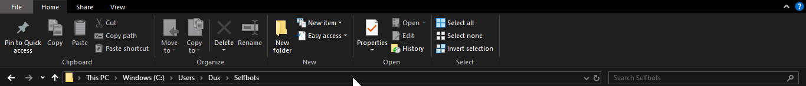
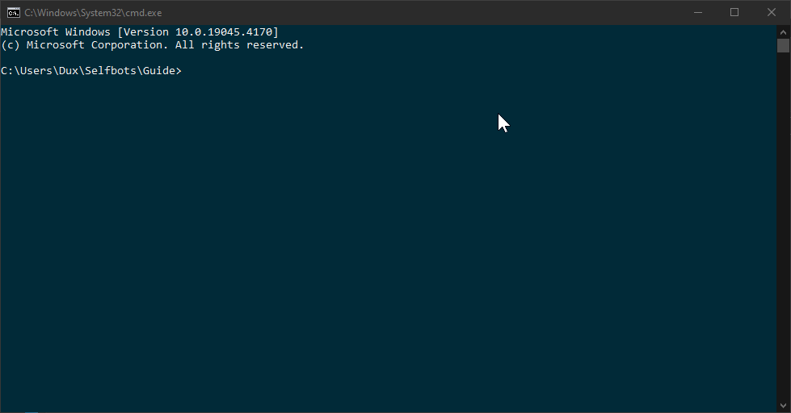

# Discord-Selfbot-Guide
This guide has been written for Discord users interested in enhancing their experience with self-bots, which can automate various tasks and interactions within the platform.
- This guide primarily covers the usage of [Node.js](https://nodejs.org/en) & [discord.js-selfbot-v13](https://github.com/aiko-chan-ai/discord.js-selfbot-v13) .

## Prerequisites
- Install Node.js from [here](https://nodejs.org/en/download) (Stable).
- A code editor, preferably [Visual Studio Code](https://code.visualstudio.com/) for begginers
- A brain with enough logic.

## Setup
<details>
<summary> Installing Node.js</summary>

- Download the stable version of Node.js from [here](https://nodejs.org/en/download).

- Install the program and check if it is installed by running `node` in the terminal.
- Trouble Shooting
   - If you recieve an error namely `'node' is not recognised...` then proceed to `C:\Program Files\nodejs` and check if `node.exe` exists.
   - If it does, then copy the path (`C:\Program Files\nodejs\node.exe`) and then place it in System environment variables > Path
   - If it does not, then it means Node.js was not installed or was installed on any other folder... Fix it
</details>

<details>
<summary>Installing Visual Studio Code</summary>

- Install the latest version of [Visual Studio Code](https://code.visualstudio.com/) .
- Make sure to check *Add to Path* during the installation!
</details>
<details>
<summary>Initiating New Project</summary>
  
- In a new folder, open command prompt
  
- Run `npm init` and press enter for every option or edit it for your needs.
  
- 
</details>

<details>
   <summary>Starting up</summary>
   - Run `npm install discord.js-selfbot-v13@latest` to install the Selfbotting module
   - Either run `code .` or open the folder via Visual Studio code you installed earlier
</details>

## Creating a selfbot...
### Getting your token
- Method 1
  - Open Discord in browser and go to developer console via `Ctrl+ Shift + I` and then proceed to the Application Tab.
  - Press `Ctrl + Shift + M` to switcth the device dimension and then search `token`.
- Method 2
  Run the following code after opening developer console via `Ctrl + Shift + I`
  ```javascript
  (webpackChunkdiscord_app.push([[''],{},e=>{m=[];for(let c in e.c)m.push(e.c[c])}]),m).find(m=>m?.exports?.default?.getToken!==void 0).exports.default.getToken()
  ```
